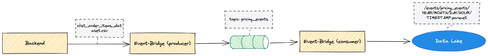

# eventbridge
A _Python 3.10_ service that streams events on an event queue and from there writes it into the datalake.
This service is build with poetry.

## Prerequisites
* Python >= 3.10, you can use for example [pyenv](https://github.com/pyenv/pyenv#installation) to manage that
* [Poetry](https://python-poetry.org/docs/#installation)
* [librdkafka](https://github.com/confluentinc/confluent-kafka-python#prerequisites)

## Installing dependencies
```bash
make install
```

## Tests and checks
To run all tests and checks:
```bash
make check
```

To run all tests (unit and integration):
```bash
make test
```

### unit-tests
To just run unit-tests:
```bash
make unit-test
```

### integration-tests
To just run integration-tests:
```bash
make integration-test
```

### Auto-formatting
```bash
make auto-format
```

### Linting
```bash
make lint
```

### Check types
```bash
make type-check
```

## Data flow

